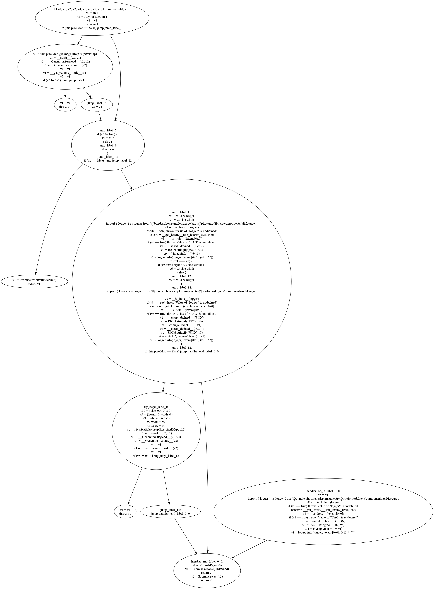

**简体中文** | [English](README.md)

# 蒲篮
蒲篮是 Open/HarmonyOS 系统所使用的 .abc 文件（方舟字节码文件）的解析器和（不成熟的）反编译器。

在希伯来语《圣经》中，蒲篮和方舟是同一个词。经文记载，摩西出生时，埃及法老下令杀死所有希伯来人的男婴，摩西的母亲为保其性命，将他装入蒲草篮放在尼罗河畔，摩西被路过的埃及公主收养，得以死里逃生。蒲篮与方舟一样象征着拯救，可以说是另一种形式的方舟。

**免责声明**：蒲篮是个人业余开发的玩具项目，由于个人能力及时间有限，不保证反编译准确性和未来的维护，使用风险自担。本项目属自由开源项目，请不要抱太高期望。

## 用法
### 命令行工具
```
usage: main.py [-h] [-pc] [-pmc CLASS] [-dmo] [-dc DECOMPILE_CLASS] [-dme DECOMPILE_METHOD] [-cfg] [-abc ABC] [-pa PA]
               [-O OUTPUT_LEVEL]

options:
  -h, --help            show this help message and exit
  -pc, --print-classes  print names of all classes
  -pmc CLASS, --print-methods-in-class CLASS
                        print names of all methods (including its class name) in the specified CLASS
  -dmo, --decompile-module
                        decompile the whole file
  -dc DECOMPILE_CLASS, --decompile-class DECOMPILE_CLASS
                        decompile all methods in the specified class
  -dme DECOMPILE_METHOD, --decompile-method DECOMPILE_METHOD
                        decompile the specified method; must be specified in the format "<class name>.<method name>"
  -cfg, --view-cfg      display the Control Flow Graph (CFG) of the specified method (graphviz required); must specify
                        method with -dme
  -abc ABC              specify the input abc file
  -pa PA                specify the input text-form Panda Assembly file
  -O OUTPUT_LEVEL, --output-level OUTPUT_LEVEL
                        output decompiled code at the specified level (possible values: llir, mlir, hlir, pcode,
                        default: pcode)
```

### Python 调用
示例：

```python
from ark.abcreader import AbcReader
from decompile.config import DecompilerConfig, DecompileGranularity, DecompileOutputLevel
from decompile.decompiler import Decompiler
from pandasm.reader import PandasmReader

# 指定输入文件，文本形式的方舟字节码（Panda Assembly，可通过 SDK 中的 ark_disasm 反汇编 abc 得到）为反编译所必需的输入
abcfile = AbcReader.from_file('<abc 文件路径>')
pafile = PandasmReader.from_file('<Panda Assembly 文件路径>')

# 配置反编译器
config = DecompilerConfig({
    'abc': abcfile,
    'pandasm': pafile,
    'output_level': DecompileOutputLevel.PSEUDOCODE,
    'class': '<要反编译的方法所在类名>',
    'method': '<要反编译的方法名>',
    'granularity': DecompileGranularity.METHOD
})

# 开始反编译
decompiler = Decompiler(config)
method = decompiler.decompile()

# 打印反编译结果
decompiler.print_code(method)

# 查看 CFG
decompiler.write_cfg_to_file(method, f'cfg/cfg_{method.name}', True)
```

## 演示
假设有如下源码，已编译成 abc：

```typescript
function foobar() {
    let i = 0
    for (i = 0; i < 5; i++) {
      hilog.info(0x0, 'hello', `world${i}`)
    }
    return i
}
```

以默认配置反编译后，结果如下（`tonumeric` 指令尚未支持）：

```typescript
let v0 
let v1 
let v2 
let v3 
v0 = 0x0
jump jump_label_1
jump_label_1:
if (v0 >= 0x5) jump jump_label_0
v1 = __is_hole__(@ohos:hilog)
if (v1 == true) throw 'Value of "hilog" is undefined'
v2 = v0
v2 = "world" + v2
v3 = v2
v2 = ""
v2 = v3 + v2
v3 = v2
v2 = @ohos:hilog["info"](FunctionObject, NewTarget, @ohos:hilog, 0x0, "hello", v3)
tonumeric 0x7
v2 = v0
v2 = v2 + 0x1
v0 = v2
jump jump_label_1
jump_label_0:
v2 = v0
return v2
```

现在尝试反编译华为提供的 ArkTS 示范代码中的一个方法，源码如下：


反编译后：



这次出现了更多不支持的指令，还有不支持的 `try-catch` 结构，反编译结果也更冗长难读了，但基本上还是正确的。

## 注意事项
蒲篮尽可能输出合法的 ArkTS/TypeScript 代码，但不是所有情况都能够做到或者容易做到这一点。

首先，蒲篮对高级语言控制流结构的恢复非常有限，因此输出的伪代码中会存在许多 `goto` 语句（表现为 `jump <标签名>`）。ArkTS 和 TypeScript 都不支持 `goto`，所以用户需要自己理清控制流并相应改写伪代码。

其次，在反编译出来的伪代码中，可能存在一些“伪函数”，用于代表无法方便地翻译成伪代码的一些操作。例如，获取[词法环境](https://gitee.com/openharmony/docs/blob/master/zh-cn/application-dev/quick-start/arkts-bytecode-fundamentals.md#%E8%AF%8D%E6%B3%95%E7%8E%AF%E5%A2%83%E5%92%8C%E8%AF%8D%E6%B3%95%E5%8F%98%E9%87%8F)的操作由 `__get_lexenv__` 来代表。

某些伪函数可以手动实现，例如 `__assert_defined__` 可以实现为：

```typescript
function __assert_defined__(obj) {
    if (typeof obj == "undefined") {
        throw "undefined"
    }
} 
```

## 已知问题
- 反编译速度极慢，主要是因为文本方舟字节码的解析和复制传播写得很烂，复杂度太高
- 支持的指令较少
- 无法恢复循环结构和部分条件结构
- 不支持 `try-catch` 结构
- 缺少类型分析（ArkTS 和 TypeScript 都是有类型的）

## 致谢
蒲篮不是一天编成的，其诞生离不开以下优秀的资料和提供这些资料的人：
- [南京大学《软件分析》课程](https://www.bilibili.com/video/BV1b7411K7P4/)，李樾老师和谭添老师授课
- 《编译原理》第 2 版（龙书），作者 Alfred V. Aho, Monica S. Lam, Ravi Sethi and Jeffrey D. Ullman
- [西安大略大学 CS447 Compiler Theory 课程](https://www.csd.uwo.ca/~mmorenom//CS447/Lectures/CodeOptimization.html/index.html)，Marc Moreno Maza 教授授课
- 卡内基梅隆大学 15-411 Compiler Design 课程的讲义 [Lecture Notes on Decompilation](https://www.cs.cmu.edu/~fp/courses/15411-f13/lectures/20-decompilation.pdf)，Frank Pfenning 教授授课，Max Serrano 编写讲义

## 许可协议
GNU AGPL v3.0
