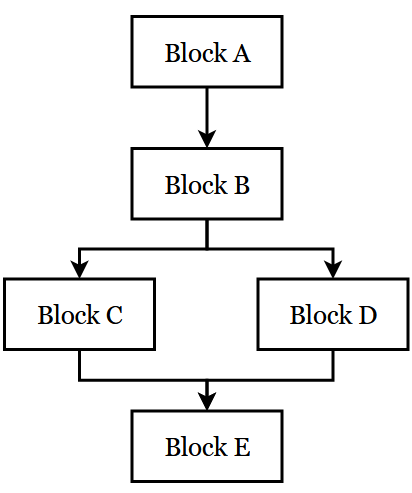

[简体中文](how_it_works_zh_simp.md) | **English**

# Under the Hood - how dayu works
The dayu decompiler works by first translating the bytecode into an intermediate representation (IR), and then translating the IR into pseudocode. This process consists of several stages, as shown in the following diagram.


We'll show you what the following method looks like at these stages to give you an idea of how the code is transformed.

```typescript
function foo() {
    let i = 0
    for (i = 0; i < 5; i++) {
      hilog.info(0x0, 'hello', `world${i}`)
    }
    return i
}
```

## Stage 1: Bytecode to Raw IR
This stage simply parses Panda Assembly, extracts bytecode instructions, and puts them into dayu's internal structures (e.g., an `NAddressCode` for each instruction). Subsequent analysis and translation will be performed on these internal structures only.

<details>
    <summary><b>Example: Raw IR</b></summary>

The Raw IR for the example method is:


</details>

## Stage 2: Raw IR to LLIR
In this stage, we build the Control Flow Graph (CFG) based on Raw IR, and lift Raw IR to LLIR. We aim to represent the operations of the original bytecode with a restricted and standardized set of IR instructions. This unified form facilitates analysis and decompilation.

The process of translating from a lower-level language to a higher-level one is known as *lifting*. We write a lifter method for each Ark opcode, in which we determine which type of LLIR instruction this should be (e.g., an assignment, or an unconditional jump) and what arguments it has. Then we replace the Raw IR instruction with an LLIR one/LLIR ones created using said information. One Raw IR instruction may translate into multiple LLIR instructions if its operation is complex (e.g., requiring pseudo-functions).

LLIR and MLIR instructions are something like the Three-Address Code (TAC), except that function calls may have more than three arguments. Therefore, they are called `NAddressCode`s or NACs instead.

At the time of writing, there are eight types of NACs:
- ASSIGN: assignment statements, takes at most three arguments
- UNCOND_JUMP: unconditional jump statements, takes exactly one argument
- COND_JUMP: conditional jump statements, takes exactly three arguments
- CALL: function/method call statements, takes at least one argument (the function/method name)
- RETURN: return statements, takes exactly one argument
- UNCOND_THROW: unconditional throw statements, takes exactly one argument
- COND_THROW: conditional throw statements, takes exactly three arguments
- UNKNOWN: reserved for code that is not "proper" IR (not having their `NAddressCode` fields properly set up), e.g. Raw IR or pseudocode, sometimes HLIR too

In the lifter methods, Raw IR will be converted to LLIR that consists of NACs of these types only. For example, the Raw IR instruction `lda v2` (assign `v2` to `acc`) will become a NAC of `ASSIGN` type, with arguments `acc` and `v2`.

### IR format constraints
In order to keep analysis easy, NACs follow a particular format at LLIR and MLIR levels. The complete format may be detailed later in a separate document (that is, if I have the time), but some general rules can be laid down right now:

- Each NAC allows at most three arguments (with a few exceptions detailed in the next point). The precise number allowed for each NAC type has been described above.
- `CALL` NACs can have more than three arguments. Expression arguments (more on this later) can have arguments within themselves. For example, in the NAC `v0 = (v1 + 1) + 2`, the second argument is an expression argument `(v1 + 1)`, which itself has two arguments `v1` and `1`. Nevertheless, this NAC is still, in form, a three-argument one (i.e. the expression argument is seen as a whole).
- The order of arguments matters, and each position has its meaning. For example, the first argument for an `ASSIGN` NAC is always the destination of assignment.
- Arguments are usually wrapped inside `PandasmInsnArgument`s, and they have types too (e.g., `reg` for register arguments).
- One type of argument, `ExprArg`, which represents expressions, allows nesting (i.e. expressions within expressions, like `(v1 + (v2 + 3))`. To keep things simple, each `arith`-type expression takes one operator and at most two operands/arguments.
- Property accesses are treated as one argument of `field` type and with a reference object, as opposed to two arguments. For example, `v0["set"]` is an argument of type `field` and with value `"set"`. Its reference object is `v0`.
- Reference objects are not nested, i.e. a reference object can't be an argument with a reference object. This ensures complicated array accesses like `acc["foo"]["bar"]` don't occur in the IR.
- There is at most one argument with a reference object in a single NAC.

Any manipulation in Stages 2 and 3 is carried out carefully so as not to break these constraints, and many manipulations presume that these constraints hold true.  

<details>
    <summary><b>Example: LLIR</b></summary>

The LLIR for the example method is:


</details>

## Stage 3: LLIR to MLIR
A powerful tool known as data flow analysis is employed in this stage to simplify LLIR. The output, MLIR, should ideally be a medium form that is easier for humans to read than LLIR, and that allows convenient analysis for machines.

In this stage, we take extra care that the IR constraints are not violated, hence the name "constrained data flow analysis". A constrained analysis guarantees its output can be used as input to itself or another analysis, thanks to its constraint-preserving property.

Mainly two data flow analyses are performed: live variable analysis (LVA) and dead code elimination (DCE). A third analysis, copy propagation, is a bit computationally expensive, and is therefore postponed to Stage 4 by default. Peephole optimization (PO) is also performed, although it's not a data flow analysis.

LVA determines which variables are dead (not used) after a certain point in a program. DCE is predicated on LVA, and it eliminates NACs whose result is never used (i.e. dead code). Consider the following NACs:

```
v1 = acc
v2 = acc
v1 = v3
```

DCE will remove the first NAC since the result of this assignment is overwritten by the third NAC and thus useless.

PO matches certain patterns in the code and rewrites them in a more concise fashion. For instance, the NAC pattern

```
a = b
b = a
```

is obviously redundant and can be rewritten as

```
a = b
```

LVA, DCE, and PO are executed repeatedly because after each iteration, some NACs may be optimized away and new dead code or optimizable patterns may emerge. We stop once no code changes after an iteration.

<details>
    <summary><b>Example: MLIR</b></summary>

The MLIR for the example method is:


</details>

## Stage 4: MLIR to HLIR
We continue to do data flow analysis, but this time in an unconstrained way. "Unconstrained" means some of the IR format constraints may be broken, and as a result, the output can't be fed into an LLIR or MLIR analysis pass anymore.

This stage involves an important analysis, copy propagation (CP). Put simply, CP tries to replace all uses of a variable with its defined value. For example, if we have

```
v1 = acc
acc = v1 + 1
```

where the first NAC is a copy (assignment) that defines `v1` and the second NAC uses `v1`. CP will replace the second `v1` with what it was defined to be, i.e. `acc`:

```
v1 = acc
acc = acc + 1
```

The astute reader may have noticed that the first NAC is now useless and can be swept away with DCE. In fact, in this stage, we follow CP immediately with DCE.

We also perform unconstrained PO here.

<details>
    <summary><b>Example: HLIR</b></summary>

The HLIR for the example method is:


</details>

## Stage 5: HLIR to pseudocode
Structured control flow is a hallmark of virtually all high-level programming languages. It's thus imperative to recover control flow structures (e.g., `if-else`, `while` loops) if we aim for high-level, human-readable pseudocode.

One of the classical algorithms for recovering control flow structures from a CFG is *structural analysis*. The basic idea behind it is fairly simple and straightforward. We start with a given CFG and match patterns in it. Certain patterns of connected basic blocks constitute a *region*, of which there are two types: acyclic and cyclic. Acyclic regions include `if-then`, `if-else-then`, and sequential blocks. Cyclic regions include self loops, `while` loops, and natural loops. The exact constructs may vary between languages, but these are what dayu deals with.

Let's take the `if-else-then` region as an example.



In this diagram, Blocks B, C, and D make up an `if-else-then` region, because they fit the pattern of that kind of region: one conditional block which has two successors, and one successor isn't a successor to the other, nor does either of them go back to the conditional block.

Now that a region match is found, we rewrite the code as:

```
<Block B>
if (...) {
    <Block C>
} else {
    <Block D>
}
```

where the `if` condition is taken from the last instruction in Block B, and then *reduce* (or merge) the region into a single block, say Block B', containing the rewritten code. Next, we have three sequential blocks (A, B', and E), which again is a kind of acyclic region and can be reduced. Finally, we're left with only one block and the algorithm terminates. In real-world cases, there are probably much more regions, so we may need to reduce over and over again until one block remains.

Beyond the general principles, there are further details that need consideration. Firstly, inner nested constructs should be processed before outer ones. Secondly, sometimes, we may encounter *improper* regions, ones that don't fit into any of the predefined patterns. They are generally dealt with by cutting one or more edges to transform the region in question into a proper one. The severed edges are replaced with a `goto` at the end of their source blocks. dayu doesn't handle improper regions for now.

Also done in Stage 5 are variable allocation, which renames registers into variables, and some minor optimizations to make the code more readable.

Congratulations! You've arrived at the destination: pseudocode. It's been a tiring journey, but (hopefully) a rewarding one too. This is the end (or is it...?).

<details>
    <summary><b>Example: Pseudocode</b></summary>

The pseudocode for the example method is:


</details>

## Appendix: Data Flow Analysis
Data flow analysis features prominently in static program analysis. It answers questions about how data propagates throughout the program by modelling the effects of certain elements, from instructions, via basic blocks and functions, to the entire program. For simplicity, we'll confine our discussion to intraprocedural analysis—analysis of functions and smaller units.

First, let's go over some commonly used concepts in data flow analysis.

A *program point* exists before the first instruction, after the last instruction, and between any two instructions in a function. We say "at program point *p*" to mean the program is in such a state that the instructions before *p* have been executed, but those after have not.

A *definition* of a variable occurs when a value is assigned/reassigned to it. A *use* of a variable refers to when its defined value is accessed (but not changed). *Killing* a definition means the value assigned by the definition is no longer valid because a new value has been assigned.

Next, determine your goal. What information do you want to know about the function? Perhaps you're interested in whether a definition is still valid at a certain program point. This analysis is what we call *reaching definitions* (RD), which we'll use as an example moving forward.

Then, depending on your goal, model the effects of an instruction. For RD, "effects" means what variables this instruction defines and what previous definitions it kills.

Next, extend the modelling to basic blocks. For each block, you'll need to keep a `gen` set for new definitions (that are not killed) in this block, and a `kill` set for definitions in the function that are killed by this block. Note that this step is essentially the same as what's done in the last step, except applied on a basic block scale. Start with empty sets and modify them as you analyze each instruction. Do this for every basic block. 

Last, once we have the sets ready for all blocks, we can combine the results to obtain RD information for the entire function. Take the definitions valid at the entry of a block (of which there are none if this is the first block, since no variables have been defined yet), remove those in the `kill` set of the block, and then add those in the `gen` set. The result is the definitions valid at the exit of the block, which are also valid at the entry of its successors. Repeat this process for the successors, and the successors to successors... The algorithm will eventually converge, and by then we'll know what variables are valid at the end of any block. More details on the algorithm can be found in compiler textbooks and on the internet.

