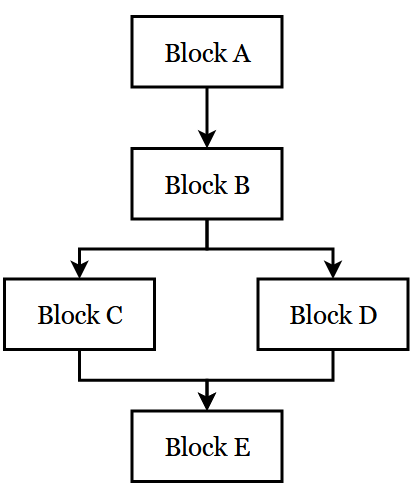

**简体中文** | [English](how_it_works.md)

# 蒲篮是怎样编成的 - 工作原理
蒲篮反编译器先将字节码转换为中间表示（IR），再将 IR 转换为伪代码。此过程可分为几阶段，如下图所示：


## 阶段 1：字节码转原始 IR
本阶段的工作是解析 Panda Assembly 反汇编结果，从中提取出各条指令，并将指令存入内部的结构体中（每条指令放入一个 `NAddressCode` 中）。后续的分析和翻译只会基于这些内部结构开展。

## 阶段 2：原始 IR 转低级 IR
在本阶段中，基于原始 IR 构建控制流图（CFG），并将原始 IR 提升为低级 IR。该阶段目标是用一组有限的、标准化的 IR 指令来表示原始字节码的操作，这种统一的形式有助于分析和反编译。

从较低级语言向较高级语言转换的过程称为**提升**。对于方舟的每种操作码，我们编写一个提升函数，提升函数负责确定该条原始 IR 指令对应于哪种类型的低级 IR 指令（如赋值指令、无条件跳转指令），并相应处理其参数。然后创建一条或多条低级 IR 指令来替代原始 IR 指令，如果该条指令所表示的操作较为复杂（例如需要伪函数），则一条原始 IR 指令可能对应为多条低级 IR 指令。

低级和中级 IR 指令类似于三地址码，但函数调用可能会有多于三个参数，因此代码中将这些指令称为 `NAddressCode`，意为“N 地址码”，简称 NAC。

截至目前，有八种类型的 NAC：
- ASSIGN: 赋值语句，最多接受三个参数
- UNCOND_JUMP: 无条件跳转语句，仅接受一个参数
- COND_JUMP: 条件跳转语句，仅接受三个参数
- CALL: 函数/方法调用语句，至少接受一个参数（即函数/方法名）
- RETURN: 返回语句，仅接受一个参数
- UNCOND_THROW: 无条件抛出异常语句，仅接受一个参数
- COND_THROW: 条件抛出异常语句，仅接受三个参数
- UNKNOWN: 专为非“合式” IR 指令（指其 `NAddressCode` 中的字段非完全设置好的状态）使用，例如原始 IR 指令、伪代码指令，有时也包含某些高级 IR 指令

提升函数把原始 IR 转换为低级 IR，低级 IR 由一条条以上类型之一的 NAC 组成。例如，一条原始 IR 指令 `lda v2`（将 `v2` 赋值给 `acc`）会变成一条 `ASSIGN` 类型的 NAC，其参数为 `acc` 和 `v2`。

### IR 格式限制
为分析简便起见，低级和中级 IR 的 NAC 遵循特定的格式。完整的格式后续若有时间会另开文档说明，在此只列出大略：

- 每条 NAC 至多允许三个参数（有少许例外，下条中说明）。每种 NAC 具体允许几个参数，上文已给出。
- `CALL` 类型的 NAC 可以有多于三个参数。表达式参数（详见后文）中可以嵌套参数，例如，`v0 = (v1 + 1) + 2` 这条 NAC 中，第二个参数是表达式参数 `(v1 + 1)`，其自身又由两个参数 `v1` 和 `1` 组成。但是，该条 NAC 形式上仍被视为是三参数的（即表达式参数视为整体）。
- 参数是有顺序的，每个位置有其意义。例如，`ASSIGN` 类型的 NAC 的第一个参数总表示赋值的目的地。
- 参数一般封装在 `PandasmInsnArgument` 中，各有其类型（如 `reg` 表示寄存器参数）。
- `ExprArg` 封装表达式参数，该类型的参数允许嵌套（即表达式中含表达式，如 `(v1 + (v2 + 3))`）。为保证分析不过于复杂，每个 `arith` 类型的表达式只有一个运算符和至多两个操作数/参数。
- 属性访问视为一个 `field` 类型且带有引用对象的参数，而非两个参数。例如，`v0["set"]` 是一个 `field` 类型的参数，值为 `"set"`，引用对象是 `v0`。
- 引用对象不嵌套，即引用对象不能又是一个带引用对象的参数。这样保证形如 `acc["foo"]["bar"]` 的多重属性访问不会出现在 IR 中。
- 一条 NAC 中至多只有一个带引用对象的参数。

阶段 2 和阶段 3 的操作都特别注意不会违背上述的限制，代码中许多操作也默认以上述限制为前提。

## 阶段 3：低级 IR 转中级 IR
该阶段使用了数据流分析这一强大的工具来简化低级 IR，我们期望，得到的输出即中级 IR 既能比低级 IR 便于人类阅读，又能便于机器分析。

本阶段会遵循上文阶段 2 所述的 IR 限制，因此在流程图中有“受限数据流分析”的说法。由于受限分析具有这种保持限制的特性，因此能保证其输出能够再被用作自身或另一分析的输入。

阶段 3 主要进行两种数据流分析：活跃变量分析和死代码消除。还有一种分析称为复制传播，由于其计算复杂度较高，默认推迟到阶段 4 进行。此外还进行窥孔优化，但窥孔优化不属于数据流分析。

活跃变量分析的任务是确定程序中某一点之后哪些变量不再活跃（即不再被使用）。死代码消除基于活跃变量分析，其任务是删除结果不会被用到的那些 NAC（即所谓死代码）。例如，给定下列 NAC：

```
v1 = acc
v2 = acc
v1 = v3
```

死代码消除会删掉第一条 NAC，因为这条赋值的结果被第三条 NAC 覆盖了，所以实际上其赋值是无用的。

窥孔优化的任务是匹配代码中特定的模式，并以更简洁的形式来改写。例如，下列模式

```
a = b
b = a
```

显然是冗余的，可以改写成：

```
a = b
```

活跃变量分析、死代码消除和窥孔优化会循环多次执行，因为每执行一遍，都可能有 NAC 被删除，从而可能产生新的死代码或可优化的模式。一旦执行完某一遍后代码没有发生改变，就停止循环。

## 阶段 4：中级 IR 转高级 IR
继续执行数据流分析，但这次是不受限的数据流分析。“不受限”指的是 IR 格式限制可能被打破，因此输出不能再被用作低级/中级 IR 分析 pass 的输入。

本阶段涉及一项重要的分析——复制传播。简单来说，复制传播会尝试把某变量的所有使用之处都替换为其定义时的值。试看下列代码：

```
v1 = acc
acc = v1 + 1
```

第一行是一句复制（即赋值），定义了 `v1`，第二行则使用了 `v1`。复制传播会把第二行的 `v1` 替换成其定义时的值，即 `acc`：

```
v1 = acc
acc = acc + 1
```

敏锐的读者可能已经发现，第一行现在变成了无用代码，可通过死代码消除来优化掉。事实上，本阶段中复制传播后确实接着进行了死代码消除。

本阶段还进行不受限的窥孔优化，此处不赘述。

## 阶段 5：高级 IR 转伪代码
几乎所有高级程序语言都支持结构化的控制流，因此若想得到可读性强的高级语言式伪代码，控制流结构（如 `if-else`、`while` 循环等）的还原是必不可少的。

从 CFG 还原控制流结构的经典算法之一称为**结构化分析**，其基本思想十分简单直观。该算法从一个给定的 CFG 开始，匹配其中的模式。以某些特定模式相连的基本块组成了所谓**区域**，分无环区域和有环区域。无环区域包括 `if-then`、`if-else-then` 和顺序块。有环区域则包括自循环、`while` 循环和自然循环。两种区域具体有哪些结构随语言而不同，以上列举的是蒲篮所处理的结构。

试以 `if-else-then` 区域举一例。



上图中，每个 Block 代表一个基本块，块 B、C、D 一起组成一个 `if-else-then` 区域，因为它们符合这种区域的特征，即其中有一个带两个后继的条件块，且两后继任一个都不是另一个的后继，也不会往回走到条件块。

找到一个区域之后，就可以将代码重写为：

```
<Block B>
if (...) {
    <Block C>
} else {
    <Block D>
}
```

其中，`if` 的条件取自块 B 的最后一条指令。接着，将该区域**化简**（合并）为一个基本块 B'，其中包含重写后的代码。现在我们有三个相继的顺序块 A、B'、E，而顺序块也是一种无环区域，因而可以被化简。最终只留下一个基本块，算法结束。在实际的程序中，区域的数量可能会多得多，相应也会需要多次化简，直到只剩一个基本块。

除了大体的原理，还有一些细节需要考虑。首先，要先处理内层嵌套的结构，再处理外层嵌套的结构。其次，有时会遇到**假区域**（improper regions），指的是不能归入任何一个预先定义的模式的区域。这种区域的一般处理方式是切断其中一些边，使其转化为真区域，而每条切断的边所代表的跳转，需要在其源基本块最后插入一条 `goto` 来等价表示。蒲篮目前不处理假区域。

阶段 5 还进行变量分配，即把寄存器重命名为变量，以及其他一些改善可读性的小优化。

到这里，我们就得到最终的伪代码了。说是最终，其实还有很多不足之处，如果有机会改进，这份文档就当作新起点的注脚吧。
